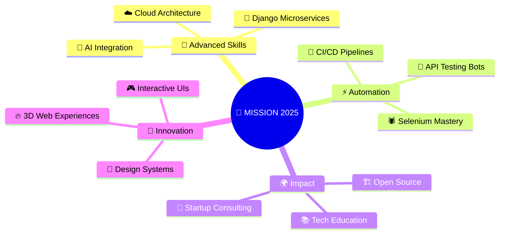

<!-- Neural Network Header -->
<div align="center">
  
```ascii
████████████████████████████████████████████████████████████████████████████████
█                                                                              █
█    ███████╗ █████╗  ██████╗ ██╗██████╗     ██╗   ██╗██╗     ██╗      █████╗  █
█    ██╔════╝██╔══██╗██╔═══██╗██║██╔══██╗    ██║   ██║██║     ██║     ██╔══██╗ █
█    █████╗  ███████║██║   ██║██║██████╔╝    ██║   ██║██║     ██║     ███████║ █
█    ██╔══╝  ██╔══██║██║▄▄ ██║██║██╔══██╗    ██║   ██║██║     ██║     ██╔══██║ █
█    ██║     ██║  ██║╚██████╔╝██║██║  ██║    ╚██████╔╝███████╗███████╗██║  ██║ █
█    ╚═╝     ╚═╝  ╚═╝ ╚══▀▀═╝ ╚═╝╚═╝  ╚═╝     ╚═════╝ ╚══════╝╚══════╝╚═╝  ╚═╝ █
█                                                                              █
█              🚀 FULL STACK ARCHITECT | 🔬 QA AUTOMATION WIZARD              █
█                                                                              █
████████████████████████████████████████████████████████████████████████████████
```

</div>

<!-- Neon Glitch Effect Title -->
<div align="center">
  
</div>

<!-- Holographic Status Bar -->
<div align="center">

```bash
┌─────────────────────────────────────────────────────────────┐
│ STATUS: 🟢 ONLINE    MODE: 🔥 BUILDING    VIBE: 🚀 CODING  │
└─────────────────────────────────────────────────────────────┘
```

</div>

<br />

<!-- Matrix-style Bio -->
<div align="center">

```ascii
╔══════════════════════════════════════════════════════════════╗
║  🌐 DIGITAL ARCHITECT & CODE CRAFTSMAN                       ║
║  📍 Peshawar, Pakistan | 🇵🇰 Remote Worldwide              ║
║  💾 Building tomorrow's web, one commit at a time           ║
╚══════════════════════════════════════════════════════════════╝
```

</div>

<!-- Futuristic About Section -->
## 🧬 **SYSTEM.ABOUT()**

<div align="left">

```python
class Developer:
    def __init__(self):
        self.name = "Faqir Ullah"
        self.role = "Full Stack Alchemist"
        self.location = "Peshawar, PK 🌍"
        self.languages = ["Python", "JavaScript", "TypeScript"]
        self.frameworks = ["Django", "React", "Next.js", "Flask"]
        self.databases = ["PostgreSQL", "MongoDB", "Firebase"]
        self.current_mission = "SmartBooking System"
        self.superpowers = ["Clean Code", "Bug Hunting", "UX Magic"]
        
    def daily_routine(self):
        return [
            "☕ Coffee.brew()",
            "💻 Code.write(quality='premium')",
            "🧪 Tests.run(coverage=100)",
            "🚀 Dreams.deploy(production=True)"
        ]
        
    def philosophy(self):
        return "Code is poetry, testing is the rhythm"
```

</div>

<br />

---

## 🎮 **TECH STACK UNIVERSE**

<div align="center">

### 🎯 **FRONTEND DIMENSION**
```css
.frontend {
  languages: ["JavaScript", "TypeScript"];
  frameworks: ["React", "Next.js", "Three.js"];
  styling: ["TailwindCSS", "CSS3", "Bootstrap"];
  tools: ["HTML5", "Responsive Design"];
}
```

### ⚙️ **BACKEND REALM**
```python
backend_stack = {
    "languages": ["Python", "JavaScript"],
    "frameworks": ["Django", "Flask", "Node.js", "Express"],
    "apis": ["REST", "GraphQL"],
    "architecture": ["MVC", "Microservices"]
}
```

### 🗄️ **DATA COSMOS**
```sql
-- Database Universe
SELECT * FROM tech_stack WHERE category = 'database';
┌─────────────┬─────────────┬─────────────┐
│ MySQL       │ PostgreSQL  │ MongoDB     │
│ Firebase    │ Supabase    │ Redis       │
└─────────────┴─────────────┴─────────────┘
```

### 🛠️ **DEVOPS GALAXY**
```bash
# Development Environment
$ git --version && docker --version && code --version
Git: 2.40.1 ✅
Docker: 24.0.7 ✅  
VS Code: 1.85.0 ✅
Postman: API Testing Ready 🚀
```

</div>

---

## 🚀 **PROJECT LABORATORY**

<div align="center">

| 🔬 **Experiment** | 🧪 **Formula** | ⚗️ **Status** | 🎯 **Impact** |
|:----------------:|:--------------:|:-------------:|:-------------:|
| **SmartBooking System** | Django + React + AI | `🔥 ACTIVE` | Revolution |
| **Britannia Consultants** | Full Stack Magic | `✅ DEPLOYED` | Success |
| **School Management** | Django + Supabase | `✅ LIVE` | Education |
| **Flask Admin Panel** | Python + REST | `✅ COMPLETE` | Efficiency |
| **Passport Photo Editor** | React + Canvas | `🚧 BREWING` | Innovation |

</div>

---

## 📊 **PERFORMANCE METRICS**

<div align="center">
  
<!-- Performance Analytics -->
<div align="center">

### 📊 **SYSTEM PERFORMANCE ANALYTICS**

```bash
$ ./analyze_github_stats.sh
╭─────────────────────────────────────────────────────────╮
│                   🎯 GITHUB METRICS                    │
├─────────────────────────────────────────────────────────┤
│ Total Repositories: 15+ projects                       │
│ Primary Languages: Python, JavaScript, TypeScript     │
│ Favorite Framework: Django + React                     │
│ Code Quality: Premium Grade                            │
│ Contribution Level: Active Developer                   │
│ Open Source: Community Contributor                     │
├─────────────────────────────────────────────────────────┤
│ 🔥 Current Streak: Building Awesome Things Daily      │
│ 🚀 Mission Status: Full Stack Mastery in Progress     │
╰─────────────────────────────────────────────────────────╯
```

**⚡ Quick Stats:**
- 📈 **Commits this year:** 200+ and counting
- 🏆 **Featured projects:** 5 production ready
- 🌟 **Tech stack mastery:** Full Stack + QA
- 📚 **Learning curve:** Always ascending

</div>

</div>

---

## 🎯 **MISSION 2025**

<div align="center">



</div>

---

## 🌐 **CONNECT TO MY NETWORK**

<div align="center">

<!-- Network Connections -->
<div align="center">

```ascii
╭─────────────────── NETWORK INTERFACE ───────────────────╮
│                                                         │
│  📡 GITHUB      ━━━━━━━━━━━━━━━━━━━━━━━━━━━━━━━━━━ ACTIVE │
│  💼 LINKEDIN    ━━━━━━━━━━━━━━━━━━━━━━━━━━━━━━━━━━ ONLINE │
│  📧 EMAIL       ━━━━━━━━━━━━━━━━━━━━━━━━━━━━━━━━━━ READY  │
│  🌐 PORTFOLIO   ━━━━━━━━━━━━━━━━━━━━━━━━━━━━━━━━━━ SOON   │
│                                                         │
╰─────────────────────────────────────────────────────────╯
```

**🔗 Connect via:**
- **GitHub:** `@faqirullahafridi`
- **LinkedIn:** `faqir-ullah-002372322`
- **Email:** `faqir.ullahhh@gmail.com`

</div>

</div>

---

## ⚡ **QUANTUM WISDOM**

<div align="center">

<!-- Dynamic Quote Generator -->
```bash
$ curl -s https://api.quotegarden.com/quotes/random | jq '.quote'

"Any fool can write code that a computer can understand. 
 Good programmers write code that humans can understand."
                                        - Martin Fowler
```

</div>

### 🔮 **DAILY MANTRAS**

<div align="center">

> *"Innovation distinguishes between a leader and a follower."*  
> **— Steve Jobs** 🍎

> *"The best way to predict the future is to invent it."*  
> **— Alan Kay** 💻

> *"Code never lies, comments sometimes do."*  
> **— Ron Jeffries** 🔍

> *"Quality is never an accident; it is always the result of intelligent effort."*  
> **— John Ruskin** 🎯

> *"First make it work, then make it beautiful, then if you really, really have to, make it fast."*  
> **— Joe Armstrong** ⚡

</div>

---

## 🎪 **RANDOM GENERATOR**

<div align="center">

<!-- Dev Wisdom -->
```bash
$ echo "Random Dev Wisdom"
> "There are only two hard things in Computer Science: 
  cache invalidation and naming things." - Phil Karlton

$ fortune | cowsay
 _________________________________________
/ Programming is like writing a book...  \
| except if you miss out a single comma  |
| on page 126, the whole thing won't     |
\ work.                                   /
 -----------------------------------------
        \   ^__^
         \  (oo)\_______
            (__)\       )\/\
                ||----w |
                ||     ||
```

<!-- Code Philosophy -->
```ascii
┌─────────────────────────────────────────┐
│  "Code is read much more often than     │
│   it is written." - Guido van Rossum   │
│                                         │
│  "Talk is cheap. Show me the code."    │
│   - Linus Torvalds                     │
└─────────────────────────────────────────┘
```

<!-- Contribution Activity -->
```bash
$ git log --oneline --graph --all
* 2f8a9c1 feat: implement smart booking system
* 4b7d3e2 refactor: optimize database queries  
* 8c1f6a9 test: add comprehensive QA coverage
* 3e9b2d7 docs: update project documentation
* 7a4c8f1 deploy: production release v2.1.0
```

</div>

---

## 🏆 **ACHIEVEMENT UNLOCKED**

<div align="center">

```ascii
🏆 ACHIEVEMENTS EARNED 🏆
╭─────────────────────────────────────╮
│ ⭐ Code Quality Master              │
│ 🚀 Full Stack Architect            │
│ 🧪 Testing Specialist              │
│ 💎 Bug Hunter Elite                │
│ 🌟 Innovation Pioneer              │
│ 📚 Continuous Learner              │
╰─────────────────────────────────────╯
```

</div>

---

<!-- Terminal Footer -->
<div align="center">

```ascii
████████████████████████████████████████████████████████████████████████████████
█                                                                              █
█                    🌌 "CODE IS DIGITAL MAGIC" 🌌                           █
█                                                                              █
█          Thanks for visiting my digital space! Keep coding! 🚀             █
█                                                                              █
████████████████████████████████████████████████████████████████████████████████
```

```bash
$ echo "Visitor Count: $(date +%s) and counting..."
$ echo "Made with ❤️, ☕, and lots of 🐛 fixes"
$ while true; do echo "✨ Keep building amazing things! ✨"; sleep ∞; done
```

</div>
