<!-- Hero Section -->
<div align="center">
  
</div>

<!-- Dynamic Typing Animation -->
<p align="center">
  
</p>

<!-- Professional Badge Section -->
<div align="center">
  
  
  
</div>

---

## 🎯 **About Me**


```typescript
const faqirUllah = {
  role: "Full Stack Developer & QA Engineer",
  location: "Peshawar, Pakistan 🇵🇰",
  passion: ["Clean Code", "User Experience", "Quality Testing"],
  currentFocus: "Building SmartBooking System",
  learningNext: ["Automation Testing", "Cloud Architecture"],
  mindset: "Code with purpose, test with precision",
  
  workingOn: {
    project: "SmartBooking System",
    type: "Full Stack Application",
    status: "In Development 🚧"
  },
  
  beliefs: [
    "Quality over Quantity",
    "Continuous Learning",
    "User-Centric Design"
  ]
};
```

---

## ⚡ **Tech Arsenal**

<div align="center">
  
### 🎨 **Frontend Mastery**
<p>
  
</p>

### 🔧 **Backend Excellence**  
<p>
  
</p>

### 🗃️ **Database Technologies**
<p>
  
</p>

### 🛠️ **Development Tools**
<p>
  
</p>

### ✅ **Quality Assurance Expertise**


</div>

---

## 🚀 **Project Showcase**

<div align="center">

| 🏆 **Featured Projects** | 🛠️ **Tech Stack** | 📊 **Status** |
|:------------------------:|:------------------:|:-------------:|
| **SmartBooking System** | Django + React + PostgreSQL | 🚧 In Progress |
| **Britannia Consultants** | Full Stack + Database | ✅ Completed |
| **School Management** | Django + Supabase | ✅ Completed |
| **Admin Panel (Flask)** | Flask + REST APIs | ✅ Completed |
| **Passport Photo Editor** | React + Canvas API | 📅 Upcoming |

</div>

---

## 📊 **GitHub Analytics**

<div align="center">
  
  
</div>

<div align="center">
  
</div>

<div align="center">
  
</div>

---

## 🎯 **2025 Roadmap**

```mermaid
graph TD
    A[🎯 2025 Goals] --> B[🚀 Advanced Django Mastery]
    A --> C[🤖 Automation Testing]
    A --> D[🌍 Open Source Contributions]
    A --> E[🏗️ Scalable Applications]
    
    B --> B1[Microservices Architecture]
    B --> B2[Cloud Deployment]
    
    C --> C1[Selenium WebDriver]
    C --> C2[API Testing Automation]
    
    D --> D1[Contributing to Django]
    D --> D2[Creating Testing Tools]
    
    E --> E1[Real-world Projects]
    E --> E2[Production-ready Apps]
```

<div align="center">



</div>

---

## 🌐 **Let's Connect**

<div align="center">
  <a href="https://github.com/faqirullahafridi">
    
  </a>
  <a href="https://www.linkedin.com/in/faqir-ullah-002372322">
    
  </a>
  <a href="mailto:faqir.ullahhh@gmail.com">
    
  </a>
  <a href="https://twitter.com/faqirullah">
    
  </a>
</div>

---

## 🌟 **Words That Inspire Me**

<div align="center">
  
</div>

### 💭 **Daily Motivations**

<div align="center">

> *"The only way to do great work is to love what you do."*  
> **— Steve Jobs**

> *"Quality is not an act, it is a habit."*  
> **— Aristotle**

> *"First, solve the problem. Then, write the code."*  
> **— John Johnson**

> *"Testing leads to failure, and failure leads to understanding."*  
> **— Burt Rutan**

> *"The best error message is the one that never shows up."*  
> **— Thomas Fuchs**

</div>

---

<div align="center">
  
### 🔥 **"Debugging is like being the detective in a crime movie where you are also the murderer."**


</div>

---

<div align="center">
  
  
  **💫 "Code with passion, test with precision, and always keep learning!" 💫**
  
  
</div>
