<!-- Cyberpunk Header -->
<div align="center">
  
</div>

<br />

<!-- Neon Glitch Effect Title -->
<div align="center">
  
</div>

<br />

<!-- Holographic Status Bar -->
<div align="center">
  
  &nbsp;&nbsp;
  
  &nbsp;&nbsp;
  
</div>

<br />
<br />

<!-- Matrix-style Bio -->
<div align="center">

```ascii
╔══════════════════════════════════════════════════════════════╗
║  🌐 DIGITAL ARCHITECT & CODE CRAFTSMAN                       ║
║  📍 Peshawar, Pakistan | 🇵🇰 Remote Worldwide              ║
║  💾 Building tomorrow's web, one commit at a time           ║
╚══════════════════════════════════════════════════════════════╝
```

</div>

<!-- Futuristic About Section -->
## 🧬 **SYSTEM.ABOUT()**

<div align="left">


```python
class Developer:
    def __init__(self):
        self.name = "Faqir Ullah"
        self.role = "Full Stack Alchemist"
        self.location = "Peshawar, PK 🌍"
        self.languages = ["Python", "JavaScript", "TypeScript"]
        self.frameworks = ["Django", "React", "Next.js", "Flask"]
        self.databases = ["PostgreSQL", "MongoDB", "Firebase"]
        self.current_mission = "SmartBooking System"
        self.superpowers = ["Clean Code", "Bug Hunting", "UX Magic"]
        
    def daily_routine(self):
        return [
            "☕ Coffee.brew()",
            "💻 Code.write(quality='premium')",
            "🧪 Tests.run(coverage=100)",
            "🚀 Dreams.deploy(production=True)"
        ]
        
    def philosophy(self):
        return "Code is poetry, testing is the rhythm"
```

</div>

<br />

---

## 🎮 **TECH STACK UNIVERSE**

<div align="center">

### 🎯 **FRONTEND DIMENSION**
<div style="display: flex; justify-content: center; gap: 10px; margin: 20px 0;">
  
  
  
  
</div>

### ⚙️ **BACKEND REALM**
<div style="display: flex; justify-content: center; gap: 10px; margin: 20px 0;">
  
  
  
</div>

### 🗄️ **DATA COSMOS**
<div style="display: flex; justify-content: center; gap: 10px; margin: 20px 0;">
  
  
</div>

### 🛠️ **DEVOPS GALAXY**
<div style="display: flex; justify-content: center; gap: 10px; margin: 20px 0;">
  
  
</div>

</div>

---

## 🚀 **PROJECT LABORATORY**

<div align="center">

| 🔬 **Experiment** | 🧪 **Formula** | ⚗️ **Status** | 🎯 **Impact** |
|:----------------:|:--------------:|:-------------:|:-------------:|
| **SmartBooking System** | Django + React + AI | `🔥 ACTIVE` | Revolution |
| **Britannia Consultants** | Full Stack Magic | `✅ DEPLOYED` | Success |
| **School Management** | Django + Supabase | `✅ LIVE` | Education |
| **Flask Admin Panel** | Python + REST | `✅ COMPLETE` | Efficiency |
| **Passport Photo Editor** | React + Canvas | `🚧 BREWING` | Innovation |

</div>

---

## 📊 **PERFORMANCE METRICS**

<div align="center">
  
<!-- GitHub Stats with Neon Theme -->


<!-- Holographic Streak -->


<!-- Activity Matrix -->


</div>

---

## 🎯 **MISSION 2025**

```mermaid
mindmap
  root((🚀 MISSION 2025))
    🔮 Advanced Skills
      🧬 Django Microservices
      ☁️ Cloud Architecture
      🤖 AI Integration
    ⚡ Automation
      🕷️ Selenium Mastery  
      📡 API Testing Bots
      🔬 CI/CD Pipelines
    🌍 Impact
      🏗️ Open Source
      📚 Tech Education
      💼 Startup Consulting
    🎨 Innovation
      🔥 3D Web Experiences
      🎮 Interactive UIs
      🌈 Design Systems
```

<div align="center">



</div>

---

## 🌐 **CONNECT TO MY NETWORK**

<div align="center">

<!-- Holographic Buttons -->
<a href="https://github.com/faqirullahafridi">
  
</a>
&nbsp;&nbsp;
<a href="https://www.linkedin.com/in/faqir-ullah-002372322">
  
</a>
&nbsp;&nbsp;
<a href="mailto:faqir.ullahhh@gmail.com">
  
</a>
&nbsp;&nbsp;
<a href="https://faqirullahafridi.github.io/Portfolio-new/">
  
</a>

</div>

---

## ⚡ **QUANTUM WISDOM**

<div align="center">

<!-- Dynamic Quote Generator -->


</div>

### 🔮 **DAILY MANTRAS**

<div align="center">

> *"Innovation distinguishes between a leader and a follower."*  
> **— Steve Jobs** 🍎

> *"The best way to predict the future is to invent it."*  
> **— Alan Kay** 💻

> *"Code never lies, comments sometimes do."*  
> **— Ron Jeffries** 🔍

> *"Quality is never an accident; it is always the result of intelligent effort."*  
> **— John Ruskin** 🎯

> *"First make it work, then make it beautiful, then if you really, really have to, make it fast."*  
> **— Joe Armstrong** ⚡

</div>

---

## 🎪 **DEV ENTERTAINMENT**

<div align="center">

<!-- Dev Joke -->


<!-- Random Quote -->


</div>

---

## 🏆 **ACHIEVEMENT UNLOCKED**

<div align="center">
  
</div>

---

<!-- Cyberpunk Footer -->
<div align="center">
  
  
  ### 🌌 **"Code is the closest thing we have to magic in the real world"** 🌌
  
  
  
</div>

<!-- Matrix Rain Effect -->
<div align="center">
  
</div>
